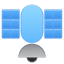

<h1 class="rich-diff-level-zero">Satellite</h1>
An elementary OS app which lets you monitor how the system resources are being utilized

## Building, Testing, and Installation

You'll need the following dependencies to build:
* libgtk-3-dev
* meson
* valac

Run `meson build` to configure the build environment and then change to the build directory and run `ninja test` to build and run automated tests

    meson build --prefix=/usr 
    cd build
    ninja test

To install, use `ninja install`, then execute with `com.github.ryanafrish7.satellite`

    sudo ninja install
    com.github.ryanafrish7.satellite
